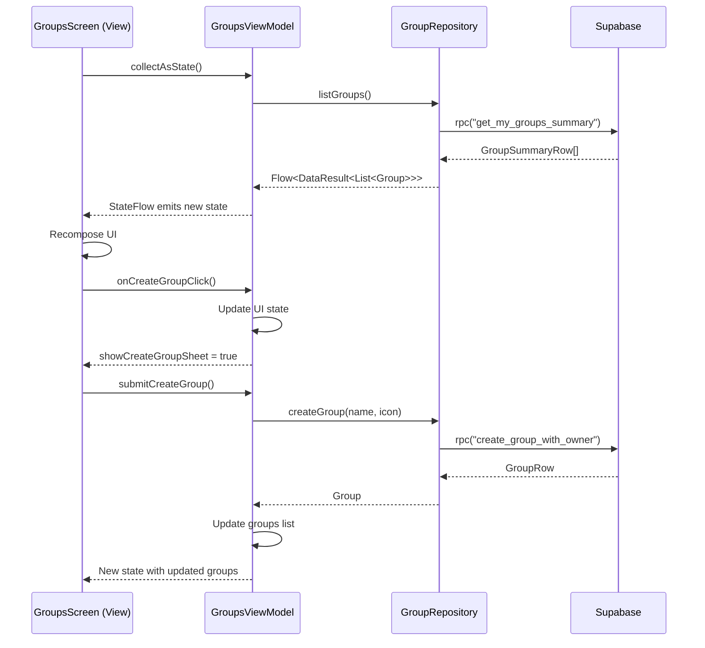

## Overview

Divvy implements the MVVM (Model-View-ViewModel) pattern to separate business logic from UI code, making the app more testable, maintainable, and scalable. With Jetpack Compose, this pattern integrates seamlessly through state management and reactive UI updates.

## MVVM Components

<CardGroup cols={3}>
  <Card title="Model" icon="database">
    Domain models and repositories that represent data and business logic
  </Card>
  
  <Card title="View" icon="desktop">
    Composable functions that display UI and handle user interactions
  </Card>
  
  <Card title="ViewModel" icon="gears">
    Manages UI state and handles business logic between View and Model
  </Card>
</CardGroup>

## Directory Structure

Each feature follows a consistent structure:

```
ui/<feature>/
├── ViewModels/
│   └── <Feature>ViewModel.kt
└── Views/
    └── <Feature>Screen.kt
```

<Tabs>
  <Tab title="Groups Feature">
    ```
    ui/groups/
    ├── ViewModels/
    │   └── GroupsViewModel.kt
    └── Views/
        └── GroupsScreen.kt
    ```
  </Tab>
  
  <Tab title="Group Detail">
    ```
    ui/groupdetail/
    ├── ViewModels/
    │   └── GroupDetailViewModel.kt
    └── Views/
        └── GroupDetailScreen.kt
    ```
  </Tab>
  
  <Tab title="Split Expense">
    ```
    ui/splitexpense/
    ├── ViewModels/
    │   └── SplitExpenseViewModel.kt
    └── Views/
        └── SplitExpenseScreen.kt
    ```
  </Tab>
</Tabs>

## State Management

Divvy uses Kotlin StateFlow for reactive state management:

```kotlin
data class ManageGroupsUiState(
    val groups: List<Group> = emptyList(),
    val isLoading: Boolean = false,
    val errorMessage: String? = null,
    val showCreateGroupSheet: Boolean = false,
    // ... other state properties
)

class GroupsViewModel @Inject constructor(
    private val groupRepository: GroupRepository
) : ViewModel() {
    
    private val _uiState = MutableStateFlow(ManageGroupsUiState(isLoading = true))
    val uiState: StateFlow<ManageGroupsUiState> = _uiState.asStateFlow()
}
```

<Note>
**StateFlow** is used instead of LiveData for better Compose integration and Kotlin coroutines support.
</Note>

## Example: Groups Feature

Let's examine the Groups feature to see MVVM in action.

### Model Layer

#### Domain Model

```kotlin app/src/main/java/com/example/divvy/models/Group.kt
data class Group(
    val id: String,
    val name: String,
    val emoji: String = "",
    val icon: GroupIcon = GroupIcon.Group,
    val memberCount: Int = 0,
    val balanceCents: Long = 0L,
    val currency: String = "USD",
    val createdBy: String = ""
) {
    val isOwed: Boolean get() = balanceCents >= 0

    val formattedBalance: String
        get() {
            val dollars = kotlin.math.abs(balanceCents) / 100.0
            return "$${String.format("%.2f", dollars)}"
        }

    val balanceLabel: String
        get() = if (isOwed) "You are owed $formattedBalance" 
                else "You owe $formattedBalance"
}
```

#### Repository Interface

```kotlin app/src/main/java/com/example/divvy/backend/GroupRepository.kt
interface GroupRepository {
    fun listGroups(): Flow<DataResult<List<Group>>>
    fun getGroup(groupId: String): Flow<Group>
    suspend fun createGroup(name: String, icon: GroupIcon): Group
    suspend fun updateGroup(groupId: String, name: String, icon: GroupIcon)
    suspend fun deleteGroup(groupId: String)
    suspend fun refreshGroups()
}
```

#### Repository Implementation

```kotlin app/src/main/java/com/example/divvy/backend/SupabaseGroupRepository.kt
@Singleton
class SupabaseGroupRepository @Inject constructor(
    private val supabaseClient: SupabaseClient
) : GroupRepository {

    private val scope = CoroutineScope(SupervisorJob() + Dispatchers.IO)
    private val _groups = MutableStateFlow<DataResult<List<Group>>>(DataResult.Loading)

    override fun listGroups(): Flow<DataResult<List<Group>>> = _groups

    override suspend fun createGroup(name: String, icon: GroupIcon): Group {
        val params = buildJsonObject {
            put("p_name", name)
            put("p_icon", icon.name)
        }
        val row = supabaseClient.postgrest
            .rpc("create_group_with_owner", params)
            .decodeSingle<GroupRow>()

        val group = Group(
            id = row.id,
            name = row.name,
            icon = iconFromName(row.icon),
            memberCount = 1,
            balanceCents = 0L,
            createdBy = row.createdBy
        )
        _groups.update { result ->
            val current = (result as? DataResult.Success)?.data ?: emptyList()
            DataResult.Success(current + group)
        }
        return group
    }

    override suspend fun refreshGroups() {
        try {
            val rows = supabaseClient.postgrest
                .rpc("get_my_groups_summary")
                .decodeList<GroupSummaryRow>()

            _groups.value = DataResult.Success(rows.map { row ->
                Group(
                    id = row.id,
                    name = row.name,
                    icon = iconFromName(row.icon),
                    memberCount = row.memberCount.toInt(),
                    balanceCents = row.balanceCents,
                    createdBy = row.createdBy
                )
            })
        } catch (e: Exception) {
            _groups.value = DataResult.Error("Failed to load groups", e)
        }
    }
}
```

### ViewModel Layer

```kotlin app/src/main/java/com/example/divvy/ui/groups/ViewModels/GroupsViewModel.kt
data class ManageGroupsUiState(
    val groups: List<Group> = emptyList(),
    val isLoading: Boolean = false,
    val errorMessage: String? = null,
    val showCreateGroupSheet: Boolean = false,
    val createStep: CreateGroupStep = CreateGroupStep.Basics,
    val createName: String = "",
    val createIcon: GroupIcon = GroupIcon.Group,
    val allProfiles: List<ProfileRow> = emptyList(),
    val selectedMemberIds: Set<String> = emptySet(),
    val isCreating: Boolean = false
)

@HiltViewModel
class GroupsViewModel @Inject constructor(
    private val groupRepository: GroupRepository,
    private val memberRepository: MemberRepository,
    private val profilesRepository: ProfilesRepository,
    private val activityRepository: ActivityRepository,
    private val authRepository: AuthRepository
) : ViewModel() {

    private val _uiState = MutableStateFlow(ManageGroupsUiState(isLoading = true))
    val uiState: StateFlow<ManageGroupsUiState> = _uiState.asStateFlow()
    private val currentUserId: String = authRepository.getCurrentUserId()

    init {
        viewModelScope.launch {
            groupRepository.listGroups().collect { result ->
                _uiState.update { current ->
                    when (result) {
                        is DataResult.Loading -> current.copy(
                            isLoading = true, 
                            errorMessage = null
                        )
                        is DataResult.Error -> current.copy(
                            isLoading = false, 
                            errorMessage = result.message
                        )
                        is DataResult.Success -> current.copy(
                            groups = result.data, 
                            isLoading = false, 
                            errorMessage = null
                        )
                    }
                }
            }
        }
    }

    fun onRetry() {
        viewModelScope.launch {
            _uiState.update { it.copy(isLoading = true, errorMessage = null) }
            groupRepository.refreshGroups()
        }
    }

    fun onCreateGroupClick() {
        _uiState.update {
            it.copy(
                showCreateGroupSheet = true,
                createStep = CreateGroupStep.Basics,
                createName = "",
                createIcon = GroupIcon.Group,
                selectedMemberIds = emptySet()
            )
        }
    }

    fun submitCreateGroup() {
        viewModelScope.launch {
            val current = _uiState.value
            _uiState.update { it.copy(isCreating = true) }
            
            runCatching {
                val createdGroup = groupRepository.createGroup(
                    current.createName, 
                    current.createIcon
                )
                
                current.selectedMemberIds.forEach { userId ->
                    memberRepository.addMember(createdGroup.id, userId)
                }
                
                groupRepository.refreshGroups()
                activityRepository.refreshActivityFeed()
            }.onSuccess {
                _uiState.update {
                    it.copy(
                        isCreating = false,
                        showCreateGroupSheet = false
                    )
                }
            }.onFailure {
                _uiState.update {
                    it.copy(
                        isCreating = false,
                        createErrorMessage = "Unable to create group"
                    )
                }
            }
        }
    }
}
```

<Info>
The `@HiltViewModel` annotation enables Hilt to inject dependencies automatically. ViewModels are scoped to the navigation destination lifecycle.
</Info>

### View Layer

```kotlin app/src/main/java/com/example/divvy/ui/groups/Views/GroupsScreen.kt
@OptIn(ExperimentalMaterial3Api::class)
@Composable
fun GroupsScreen(
    viewModel: GroupsViewModel = hiltViewModel(),
    onGroupClick: (String) -> Unit,
    onCreatedGroupNavigate: (String) -> Unit
) {
    val uiState by viewModel.uiState.collectAsState()
    
    LaunchedEffect(uiState.createCompletedGroupId) {
        val groupId = uiState.createCompletedGroupId ?: return@LaunchedEffect
        onCreatedGroupNavigate(groupId)
        viewModel.onCreateNavigationHandled()
    }

    Scaffold(
        topBar = {
            TopAppBar(
                title = { Text("Groups") },
                actions = {
                    Box(
                        modifier = Modifier
                            .size(36.dp)
                            .clip(CircleShape)
                            .background(MaterialTheme.colorScheme.primary)
                            .clickable { viewModel.onCreateGroupClick() },
                        contentAlignment = Alignment.Center
                    ) {
                        Icon(
                            imageVector = Icons.Filled.Add,
                            contentDescription = "Add group",
                            tint = Color.White
                        )
                    }
                }
            )
        }
    ) { innerPadding ->
        when {
            uiState.isLoading -> {
                Box(
                    modifier = Modifier.fillMaxSize(),
                    contentAlignment = Alignment.Center
                ) {
                    CircularProgressIndicator()
                }
            }
            uiState.errorMessage != null -> {
                ErrorView(
                    message = uiState.errorMessage,
                    onRetry = viewModel::onRetry
                )
            }
            else -> {
                GroupsList(
                    groups = uiState.groups,
                    onGroupClick = onGroupClick,
                    onCreateClick = viewModel::onCreateGroupClick
                )
            }
        }
    }
    
    if (uiState.showCreateGroupSheet) {
        CreateGroupSheet(
            step = uiState.createStep,
            name = uiState.createName,
            selectedIcon = uiState.createIcon,
            onNameChange = viewModel::onCreateNameChange,
            onIconSelected = viewModel::onCreateIconSelected,
            onCreate = viewModel::submitCreateGroup,
            onDismiss = viewModel::onCreateGroupDismiss
        )
    }
}
```

## Key Patterns

### Repository Injection via Hilt

```kotlin
@HiltViewModel
class GroupsViewModel @Inject constructor(
    private val groupRepository: GroupRepository,
    private val memberRepository: MemberRepository
) : ViewModel()
```

Hilt automatically provides repository instances configured in `AppModule.kt`.

### State Updates with StateFlow

```kotlin
_uiState.update { currentState ->
    currentState.copy(isLoading = false, groups = newGroups)
}
```

<Note>
Using `.update { }` ensures atomic state updates and prevents race conditions.
</Note>

### Collecting State in Compose

```kotlin
val uiState by viewModel.uiState.collectAsState()
```

Compose automatically recomposes when `uiState` changes.

### Handling Side Effects

```kotlin
LaunchedEffect(uiState.createCompletedGroupId) {
    val groupId = uiState.createCompletedGroupId ?: return@LaunchedEffect
    onCreatedGroupNavigate(groupId)
    viewModel.onCreateNavigationHandled()
}
```

`LaunchedEffect` handles one-time events like navigation while keeping the ViewModel logic clean.

## Data Flow Diagram



## Testing Benefits

The MVVM pattern makes testing easier:

<Tabs>
  <Tab title="ViewModel Tests">
    ```kotlin
    class GroupsViewModelTest {
        @Test
        fun `when createGroup succeeds, groups list is updated`() = runTest {
            val repository = FakeGroupRepository()
            val viewModel = GroupsViewModel(repository)
            
            viewModel.submitCreateGroup()
            
            val state = viewModel.uiState.value
            assertEquals(1, state.groups.size)
            assertFalse(state.showCreateGroupSheet)
        }
    }
    ```
  </Tab>
  
  <Tab title="Repository Tests">
    ```kotlin
    class SupabaseGroupRepositoryTest {
        @Test
        fun `refreshGroups updates groups flow`() = runTest {
            val repository = SupabaseGroupRepository(mockClient)
            
            repository.refreshGroups()
            
            val result = repository.listGroups().first()
            assertTrue(result is DataResult.Success)
        }
    }
    ```
  </Tab>
  
  <Tab title="UI Tests">
    ```kotlin
    @Test
    fun groupsScreen_displaysGroups() {
        composeTestRule.setContent {
            GroupsScreen(
                viewModel = viewModelWithMockData,
                onGroupClick = {},
                onCreatedGroupNavigate = {}
            )
        }
        
        composeTestRule
            .onNodeWithText("Roommates")
            .assertIsDisplayed()
    }
    ```
  </Tab>
</Tabs>

## Best Practices

<Steps>
  <Step title="Single Responsibility">
    Each ViewModel manages state for one screen or feature
  </Step>
  
  <Step title="Immutable State">
    Use `data class` with `copy()` for immutable state updates
  </Step>
  
  <Step title="Coroutine Scope">
    Always use `viewModelScope` for coroutines - they're automatically cancelled
  </Step>
  
  <Step title="Error Handling">
    Include error states in your UI state and handle them in the View
  </Step>
  
  <Step title="Loading States">
    Always show loading indicators during async operations
  </Step>
</Steps>

<Warning>
Never reference Android Context or View classes directly in ViewModels. This creates memory leaks and makes testing difficult.
</Warning>

## Next Steps

<CardGroup cols={2}>
  <Card title="Navigation" icon="route" href="/architecture/navigation">
    Learn how navigation works with MVVM
  </Card>
  
  <Card title="Architecture Overview" icon="sitemap" href="/architecture/overview">
    Return to architecture overview
  </Card>
</CardGroup>