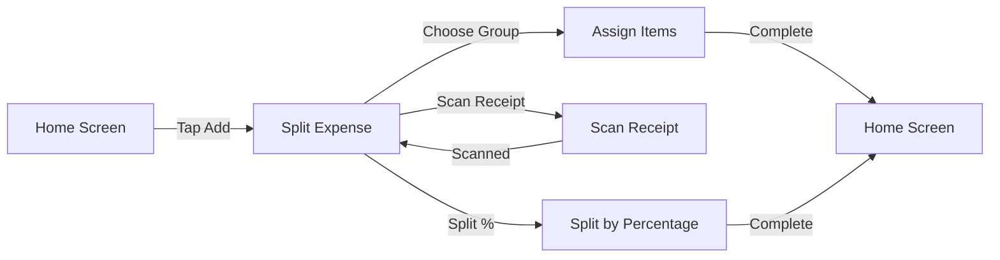
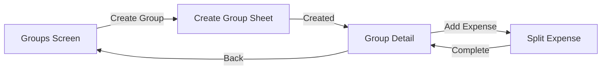

## Overview

Divvy uses Jetpack Compose Navigation with Kotlin serialization for type-safe navigation. This approach eliminates string-based routes and provides compile-time safety for navigation arguments.

## Navigation Destinations

All app destinations are defined as a sealed interface with serializable data classes:

```kotlin app/src/main/java/com/example/divvy/ui/navigation/AppDestination.kt
@Serializable
sealed interface AppDestination {

    @Serializable data object Home      : AppDestination
    @Serializable data object Groups    : AppDestination
    @Serializable data object Friends   : AppDestination
    @Serializable data object Ledger    : AppDestination
    @Serializable data object Analytics : AppDestination
    @Serializable data object Profile   : AppDestination

    @Serializable
    data class GroupDetail(val groupId: String) : AppDestination

    @Serializable
    data object ScanReceipt : AppDestination

    @Serializable
    data class SplitExpense(
        val scannedAmount: String = "",
        val scannedDescription: String = "",
        val preselectedGroupId: String = ""
    ) : AppDestination

    @Serializable
    data class AssignItems(
        val groupId: String,
        val amountDisplay: String,
        val description: String
    ) : AppDestination

    @Serializable
    data class SplitByPercentage(
        val groupId: String,
        val amountDisplay: String,
        val description: String
    ) : AppDestination
}
```

<Info>
**Type Safety**: Using `@Serializable` data classes ensures navigation arguments are type-safe and validated at compile time.
</Info>

## Navigation Routes

<CardGroup cols={2}>
  <Card title="Main Tabs" icon="table-cells">
    - **Home** - Activity feed and quick actions
    - **Groups** - Manage expense groups
    - **Friends** - Friend connections
    - **Profile** - User account settings
  </Card>
  
  <Card title="Feature Flows" icon="diagram-project">
    - **GroupDetail** - View group expenses and members
    - **ScanReceipt** - Camera-based receipt scanning
    - **SplitExpense** - Choose split method
    - **AssignItems** - Item-level expense assignment
    - **SplitByPercentage** - Percentage-based splits
  </Card>
  
  <Card title="Secondary Screens" icon="window">
    - **Ledger** - All balances and settlements
    - **Analytics** - Spending insights
  </Card>
</CardGroup>

## Navigation Graph

The `AppNavHost` defines the navigation graph with all composable destinations:

```kotlin app/src/main/java/com/example/divvy/ui/navigation/AppNavHost.kt
@Composable
fun AppNavHost(
    navController: NavHostController,
    modifier: Modifier = Modifier
) {
    NavHost(
        navController = navController,
        startDestination = AppDestination.Home,
        modifier = modifier
    ) {
        composable<AppDestination.Home> {
            HomeScreen(
                onGroupClick = { id -> 
                    navController.navigate(AppDestination.GroupDetail(id)) 
                },
                onGroupsClick = {
                    navController.navigate(AppDestination.Groups) {
                        popUpTo(navController.graph.findStartDestination().id) { 
                            saveState = true 
                        }
                        launchSingleTop = true
                        restoreState = true
                    }
                },
                onAddExpense = { 
                    navController.navigate(AppDestination.SplitExpense()) 
                },
                onLedgerClick = { 
                    navController.navigate(AppDestination.Ledger) 
                }
            )
        }
        
        composable<AppDestination.Groups> {
            GroupsScreen(
                onGroupClick = { id -> 
                    navController.navigate(AppDestination.GroupDetail(id)) 
                },
                onCreatedGroupNavigate = { id ->
                    navController.navigate(AppDestination.GroupDetail(id))
                }
            )
        }
        
        composable<AppDestination.GroupDetail> { backStack ->
            val dest: AppDestination.GroupDetail = backStack.toRoute()
            GroupDetailScreen(
                groupId = dest.groupId,
                onBack = { navController.popBackStack() },
                onLeaveGroup = {
                    navController.popBackStack(
                        route = AppDestination.Home,
                        inclusive = false
                    )
                },
                onAddExpense = {
                    navController.navigate(
                        AppDestination.SplitExpense(
                            preselectedGroupId = dest.groupId
                        )
                    )
                }
            )
        }
        
        composable<AppDestination.ScanReceipt> {
            ScanReceiptScreen(
                onBack = { navController.popBackStack() },
                onScanComplete = { amount, description ->
                    navController.popBackStack()
                    navController.navigate(
                        AppDestination.SplitExpense(
                            scannedAmount = amount,
                            scannedDescription = description
                        )
                    )
                }
            )
        }
        
        composable<AppDestination.SplitExpense> {
            SplitExpenseScreen(
                onBack = { navController.popBackStack() },
                onNavigateToAssignItems = { groupId, amount, description ->
                    navController.navigate(
                        AppDestination.AssignItems(groupId, amount, description)
                    )
                },
                onNavigateToSplitByPercentage = { groupId, amount, description ->
                    navController.navigate(
                        AppDestination.SplitByPercentage(groupId, amount, description)
                    )
                }
            )
        }
    }
}
```

## Navigation with Arguments

### Passing Arguments

Navigation arguments are passed as constructor parameters:

<Tabs>
  <Tab title="Simple Navigation">
    ```kotlin
    // Navigate to group detail with group ID
    navController.navigate(
        AppDestination.GroupDetail(groupId = "abc123")
    )
    ```
  </Tab>
  
  <Tab title="Multiple Arguments">
    ```kotlin
    // Navigate with multiple parameters
    navController.navigate(
        AppDestination.AssignItems(
            groupId = "abc123",
            amountDisplay = "$42.50",
            description = "Dinner at Pizza Palace"
        )
    )
    ```
  </Tab>
  
  <Tab title="Optional Arguments">
    ```kotlin
    // Optional parameters with defaults
    navController.navigate(
        AppDestination.SplitExpense(
            scannedAmount = "25.00",
            scannedDescription = "Groceries"
            // preselectedGroupId uses default empty string
        )
    )
    ```
  </Tab>
</Tabs>

### Retrieving Arguments

Arguments are retrieved using `toRoute()` extension function:

```kotlin
composable<AppDestination.GroupDetail> { backStack ->
    val dest: AppDestination.GroupDetail = backStack.toRoute()
    GroupDetailScreen(
        groupId = dest.groupId,  // Type-safe access
        onBack = { navController.popBackStack() }
    )
}
```

## ViewModel Factory with Arguments

For ViewModels that need navigation arguments, use Hilt's assisted injection:

```kotlin app/src/main/java/com/example/divvy/ui/navigation/AppNavHost.kt
composable<AppDestination.SplitByPercentage> { backStack ->
    val dest: AppDestination.SplitByPercentage = backStack.toRoute()
    val viewModel = hiltViewModel<
        SplitByPercentageViewModel, 
        SplitByPercentageViewModel.Factory
    >(
        creationCallback = { factory ->
            factory.create(
                dest.groupId, 
                dest.amountDisplay, 
                dest.description
            )
        }
    )
    SplitByPercentageScreen(
        viewModel = viewModel,
        onBack = { navController.popBackStack() },
        onDone = {
            navController.popBackStack(
                route = AppDestination.Home,
                inclusive = false
            )
        }
    )
}
```

<Note>
The ViewModel factory pattern allows Hilt to inject dependencies while accepting navigation arguments.
</Note>

## Bottom Navigation

The bottom navigation bar provides quick access to main tabs:

```kotlin app/src/main/java/com/example/divvy/ui/navigation/BottomNavigationBar.kt
@Composable
fun BottomNavigationBar(navController: NavController) {
    val navBackStackEntry by navController.currentBackStackEntryAsState()
    val currentDestination = navBackStackEntry?.destination

    Box(
        modifier = Modifier.fillMaxWidth().height(80.dp),
        contentAlignment = Alignment.BottomCenter
    ) {
        Row(
            modifier = Modifier
                .fillMaxWidth()
                .height(64.dp)
                .background(MaterialTheme.colorScheme.surface),
            horizontalArrangement = Arrangement.SpaceAround
        ) {
            NavItem(
                icon = Icons.Rounded.Home,
                label = "Home",
                isSelected = currentDestination?.hasRoute<AppDestination.Home>() == true,
                onClick = {
                    navController.navigate(AppDestination.Home) {
                        popUpTo(navController.graph.findStartDestination().id) { 
                            saveState = true 
                        }
                        launchSingleTop = true
                        restoreState = true
                    }
                }
            )
            
            NavItem(
                icon = Icons.Rounded.Group,
                label = "Groups",
                isSelected = currentDestination?.hasRoute<AppDestination.Groups>() == true,
                onClick = {
                    navController.navigate(AppDestination.Groups) {
                        popUpTo(navController.graph.findStartDestination().id) { 
                            saveState = true 
                        }
                        launchSingleTop = true
                        restoreState = true
                    }
                }
            )
            
            Spacer(modifier = Modifier.size(48.dp)) // Space for FAB
            
            NavItem(
                icon = Icons.Rounded.People,
                label = "Friends",
                isSelected = currentDestination?.hasRoute<AppDestination.Friends>() == true,
                onClick = { /* ... */ }
            )
            
            NavItem(
                icon = Icons.Rounded.Person,
                label = "Account",
                isSelected = currentDestination?.hasRoute<AppDestination.Profile>() == true,
                onClick = { /* ... */ }
            )
        }
        
        // Center FAB for receipt scanning
        Box(
            modifier = Modifier
                .align(Alignment.TopCenter)
                .offset(y = (-20).dp)
                .size(56.dp)
                .clip(CircleShape)
                .background(MaterialTheme.colorScheme.primary)
                .clickable { navController.navigate(AppDestination.ScanReceipt) },
            contentAlignment = Alignment.Center
        ) {
            Icon(
                imageVector = Icons.Default.CameraAlt,
                contentDescription = "Scan Receipt"
            )
        }
    }
}
```

### Navigation Options for Tabs

<Tabs>
  <Tab title="Save State">
    ```kotlin
    popUpTo(navController.graph.findStartDestination().id) { 
        saveState = true 
    }
    ```
    Preserves the state when navigating away from a tab
  </Tab>
  
  <Tab title="Launch Single Top">
    ```kotlin
    launchSingleTop = true
    ```
    Prevents multiple instances of the same destination
  </Tab>
  
  <Tab title="Restore State">
    ```kotlin
    restoreState = true
    ```
    Restores saved state when returning to a tab
  </Tab>
</Tabs>

## Deep Linking

Divvy supports deep linking for group invitations through Supabase Auth:

### Auth Redirect Configuration

```kotlin app/src/main/java/com/example/divvy/di/NetworkModule.kt
install(Auth) {
    scheme = "com.example.divvy"
    host = "auth"
    defaultExternalAuthAction = ExternalAuthAction.CUSTOM_TABS
}
```

### Redirect URL Pattern

```
com.example.divvy://auth
```

This URL must be configured in Supabase Auth settings to enable:
- Google OAuth sign-in redirects
- Group invitation deep links
- Password reset flows

<Warning>
Ensure the redirect URL is added to your Supabase project's Auth settings under "Redirect URLs".
</Warning>

### AndroidManifest Configuration

```xml
<activity android:name=".MainActivity">
    <intent-filter>
        <action android:name="android.intent.action.VIEW" />
        <category android:name="android.intent.category.DEFAULT" />
        <category android:name="android.intent.category.BROWSABLE" />
        <data
            android:scheme="com.example.divvy"
            android:host="auth" />
    </intent-filter>
</activity>
```

## Navigation Flow Examples

### Creating an Expense



### Group Management



## Back Stack Management

### Pop to Destination

```kotlin
// Return to Home after completing expense
navController.popBackStack(
    route = AppDestination.Home,
    inclusive = false  // Keep Home in the stack
)
```

### Pop Current Screen

```kotlin
// Simple back navigation
navController.popBackStack()
```

### Clear Back Stack

```kotlin
// Navigate to Home and clear everything else
navController.navigate(AppDestination.Home) {
    popUpTo(0) { inclusive = true }
    launchSingleTop = true
}
```

## Testing Navigation

### Navigation Testing Example

```kotlin
@Test
fun navigateToGroupDetail_displaysGroupId() {
    val navController = TestNavHostController(context)
    navController.setGraph(R.navigation.app_nav_graph)
    
    composeTestRule.setContent {
        AppNavHost(navController = navController)
    }
    
    // Navigate to group detail
    navController.navigate(AppDestination.GroupDetail("group123"))
    
    // Verify navigation
    assertEquals(
        AppDestination.GroupDetail("group123"),
        navController.currentBackStackEntry?.toRoute()
    )
}
```

## Best Practices

<Steps>
  <Step title="Use Type-Safe Routes">
    Always use `AppDestination` sealed interface instead of string routes
  </Step>
  
  <Step title="Validate Arguments">
    Use non-nullable types for required arguments, nullable types for optional ones
  </Step>
  
  <Step title="Handle Back Navigation">
    Always provide `onBack` callbacks in screen composables
  </Step>
  
  <Step title="Save Tab State">
    Use `saveState` and `restoreState` for bottom navigation tabs
  </Step>
  
  <Step title="Avoid Deep Stacks">
    Pop back to main screens after completing flows (like expense creation)
  </Step>
</Steps>

<Warning>
Don't pass complex objects through navigation. Use IDs and fetch data in ViewModels using repositories.
</Warning>

## Common Patterns

### Conditional Navigation

```kotlin
LaunchedEffect(uiState.createCompletedGroupId) {
    val groupId = uiState.createCompletedGroupId ?: return@LaunchedEffect
    onCreatedGroupNavigate(groupId)
    viewModel.onCreateNavigationHandled()
}
```

### Multi-Step Flows

```kotlin
// Step 1: Split Expense
SplitExpenseScreen(
    onNavigateToAssignItems = { groupId, amount, description ->
        navController.navigate(
            AppDestination.AssignItems(groupId, amount, description)
        )
    }
)

// Step 2: Assign Items
AssignItemsScreen(
    onDone = {
        navController.popBackStack(
            route = AppDestination.Home,
            inclusive = false
        )
    }
)
```

## Next Steps

<CardGroup cols={2}>
  <Card title="MVVM Pattern" icon="layer-group" href="/architecture/mvvm-pattern">
    Learn how navigation integrates with ViewModels
  </Card>
  
  <Card title="Architecture Overview" icon="sitemap" href="/architecture/overview">
    Return to architecture overview
  </Card>
</CardGroup>