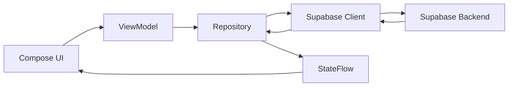

## Overview

Divvy is built as a modern Android application using Kotlin and Jetpack Compose with a clean MVVM architecture. The app simplifies group expense splitting by bringing it to the moment of payment through bank integration and receipt scanning.

## Technology Stack

<CardGroup cols={2}>
  <Card title="Frontend" icon="mobile">
    - **Kotlin** - Primary language
    - **Jetpack Compose** - Modern UI toolkit
    - **Material 3** - Design system
    - **Navigation Compose** - Type-safe navigation
  </Card>
  
  <Card title="Backend & Data" icon="database">
    - **Supabase** - Database and authentication
    - **Postgrest** - Database queries
    - **GoTrue** - Auth provider
    - **Plaid** - Bank integration (planned)
  </Card>
  
  <Card title="Dependency Injection" icon="diagram-project">
    - **Hilt** - DI framework
    - **Dagger** - Compile-time DI
  </Card>
  
  <Card title="Camera & Media" icon="camera">
    - **CameraX** - Receipt scanning
    - **Coil** - Image loading
  </Card>
</CardGroup>

## Project Structure

The Divvy codebase follows a feature-based organization within the MVVM pattern:

```
app/src/main/java/com/example/divvy/
├── backend/          # Repositories and data access layer
├── ui/               # UI layer organized by feature
│   ├── analytics/
│   ├── assignitems/
│   ├── auth/
│   ├── expenses/
│   ├── friends/
│   ├── groupdetail/
│   ├── groups/
│   ├── home/
│   ├── ledger/
│   ├── profile/
│   ├── scanreceipt/
│   ├── splitexpense/
│   ├── splitpercentage/
│   ├── navigation/   # Navigation graph and routes
│   └── theme/        # Material 3 theming
├── models/           # Domain models
├── components/       # Reusable UI components
└── di/               # Dependency injection modules
```

<Note>
Each feature in the `ui/` directory typically contains `ViewModels/` and `Views/` subdirectories, maintaining clear separation between business logic and presentation.
</Note>

## Data Flow Architecture

Divvy implements a unidirectional data flow pattern:



<Steps>
  <Step title="User Interaction">
    User interacts with Compose UI components (buttons, text fields, etc.)
  </Step>
  
  <Step title="ViewModel Processing">
    UI events are handled by ViewModels which contain business logic
  </Step>
  
  <Step title="Repository Layer">
    ViewModels call repository methods for data operations
  </Step>
  
  <Step title="Backend Communication">
    Repositories interact with Supabase through the SupabaseClient
  </Step>
  
  <Step title="State Updates">
    Data flows back through StateFlow/Flow emissions
  </Step>
  
  <Step title="UI Recomposition">
    Compose UI automatically recomposes when state changes
  </Step>
</Steps>

## Dependency Injection Setup

Divvy uses Hilt for dependency injection with two main modules:

### NetworkModule

Provides the Supabase client configuration:

```kotlin app/src/main/java/com/example/divvy/di/NetworkModule.kt
@Module
@InstallIn(SingletonComponent::class)
object NetworkModule {

    @Provides
    @Singleton
    fun provideSupabaseClient(): SupabaseClient {
        val client = createSupabaseClient(
            supabaseUrl = BuildConfig.SUPABASE_URL,
            supabaseKey = BuildConfig.SUPABASE_ANON_KEY
        ) {
            defaultSerializer = KotlinXSerializer(Json { ignoreUnknownKeys = true })
            install(Auth) {
                scheme = "com.example.divvy"
                host = "auth"
                defaultExternalAuthAction = ExternalAuthAction.CUSTOM_TABS
            }
            install(Postgrest)
        }
        SupabaseClientProvider.setClient(client)
        return client
    }
}
```

### AppModule

Binds repository interfaces to their Supabase implementations:

```kotlin app/src/main/java/com/example/divvy/di/AppModule.kt
@Module
@InstallIn(SingletonComponent::class)
abstract class AppModule {
    @Binds @Singleton abstract fun bindAuthRepository(
        impl: SupabaseAuthRepository
    ): AuthRepository
    
    @Binds @Singleton abstract fun bindGroupRepository(
        impl: SupabaseGroupRepository
    ): GroupRepository
    
    @Binds @Singleton abstract fun bindMemberRepository(
        impl: SupabaseMemberRepository
    ): MemberRepository
    
    @Binds @Singleton abstract fun bindBalanceRepository(
        impl: SupabaseBalanceRepository
    ): BalanceRepository
    
    @Binds @Singleton abstract fun bindExpensesRepository(
        impl: SupabaseExpensesRepository
    ): ExpensesRepository
    
    @Binds @Singleton abstract fun bindProfilesRepository(
        impl: SupabaseProfilesRepository
    ): ProfilesRepository
    
    @Binds @Singleton abstract fun bindActivityRepository(
        impl: SupabaseActivityRepository
    ): ActivityRepository
}
```

<Info>
All repositories are provided as singletons to ensure consistent state across the app and efficient resource usage.
</Info>

## Build Configuration

Key build configuration from `app/build.gradle.kts`:

<Tabs>
  <Tab title="Android Config">
    ```kotlin
    android {
        namespace = "com.example.divvy"
        compileSdk = 36

        defaultConfig {
            applicationId = "com.example.divvy"
            minSdk = 26
            targetSdk = 36
            versionCode = 1
            versionName = "1.0"
        }
        
        buildFeatures {
            compose = true
            buildConfig = true
        }
    }
    ```
  </Tab>
  
  <Tab title="Plugins">
    ```kotlin
    plugins {
        alias(libs.plugins.android.application)
        alias(libs.plugins.kotlin.android)
        alias(libs.plugins.kotlin.serialization)
        alias(libs.plugins.kotlin.compose)
        alias(libs.plugins.ksp)
        alias(libs.plugins.hilt.android)
    }
    ```
  </Tab>
  
  <Tab title="Key Dependencies">
    ```kotlin
    dependencies {
        // Compose
        implementation(platform(libs.androidx.compose.bom))
        implementation(libs.androidx.compose.ui)
        implementation(libs.androidx.compose.material3)
        implementation(libs.androidx.navigation.compose)
        
        // Supabase
        implementation(platform(libs.supabase.bom))
        implementation(libs.supabase.postgrest.kt)
        implementation(libs.supabase.gotrue.kt)
        
        // Hilt DI
        implementation(libs.hilt.android)
        ksp(libs.hilt.android.compiler)
        implementation(libs.androidx.hilt.navigation.compose)
        
        // CameraX
        implementation(libs.androidx.camera.core)
        implementation(libs.androidx.camera.camera2)
        implementation(libs.androidx.camera.lifecycle)
        implementation(libs.androidx.camera.view)
    }
    ```
  </Tab>
</Tabs>

## Environment Configuration

Divvy uses `local.properties` for environment-specific configuration:

```properties
SUPABASE_URL=https://xxxx.supabase.co
SUPABASE_ANON_KEY=eyJ...
```

<Warning>
Never commit `local.properties` to version control. These values are injected at build time using BuildConfig.
</Warning>

## Authentication Flow

Supabase Auth is configured with custom URL scheme for OAuth redirects:

- **Redirect URL**: `com.example.divvy://auth`
- **Auth Method**: Google OAuth via Custom Tabs
- **Session Management**: Handled by Supabase GoTrue SDK

The redirect URL must be configured in Supabase Auth settings to enable Google sign-in.

## Next Steps

<CardGroup cols={2}>
  <Card title="MVVM Pattern" icon="layer-group" href="/architecture/mvvm-pattern">
    Learn how ViewModels and Views work together
  </Card>
  
  <Card title="Navigation" icon="route" href="/architecture/navigation">
    Explore the navigation architecture
  </Card>
</CardGroup>